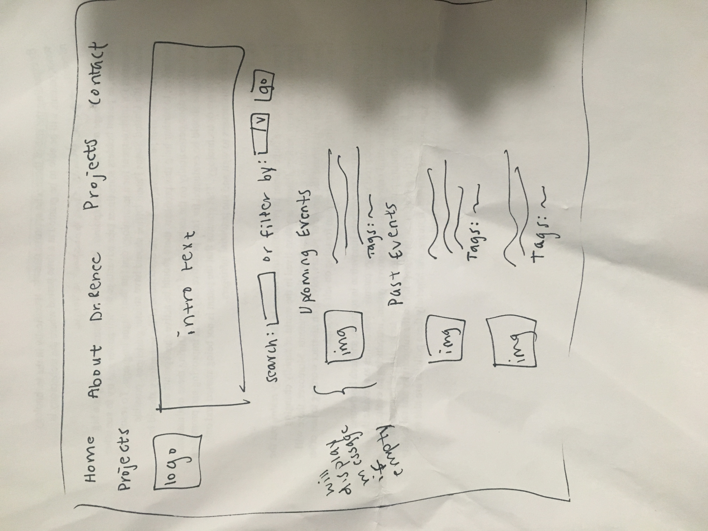

# Project 4: Design Journey

Your Team Name: Black Horse

**All images must be visible in Markdown Preview. No credit will be provided for images in your repository that are not properly linked in Markdown. Assume all file paths are case sensitive!**


## Client Description

[Tell us about your client. Who is your client? What kind of website do they want? What are their key goals?]

[NOTE: If you are redesigning an existing website, give us the current URL and some screenshots of the current site. Tell us how you plan to update the site in a significant way that meets the final project requirements.]

Dr. Renee Alexander is the associate dean of students at Cornell University, and focuses on campus climate issues. She is most known for her Breaking Bread initiative, as well as a Ted Talk she recently did. She is currently in a new stage in her life and career and is looking for a way to help brand herself while showcasing her personal achievments, work, and on-campus involvement. Dr. Renee would also like a website to bring traffic to her Ted Talk while increasing involvement/participation rates for her events and initiatives. In this way, the site is meant to be both a display and promotion of Dr. Renee's various endeavours.

## Meeting Notes

[By this point, you have met once with your client to discuss all their requirements. Include your notes from the meeting, an email they sent you, or whatever you used to keep track of what was discussed at the meeting. Include these artifacts here.]

First Meeting Notes:


## Purpose & Content

[Tell us the purpose of the website and what it is all about.]

The purpose of the website is to showcase the client and her work, so that students, administators, and other faculty members will be able to easily learn about her work and on-going projects. She also wants to use the site to provide an easy way for interested audience members to contact her (through a specific email account.)

## Target Audience(s)

[Tell us about the potential audiences for this website. How, when, and where would they interact with the website? Get as much detail as possible from the client to help you find representative users.]

The potential target audiences for this site includes a primary and secondary one. The client's primary audience seems to be members of the student body at Cornell who are facing administrative difficulties regarding diversity and inclusion. Her secondary audience targets administrators who work with these students. This group includes faculty and staff, and mostly the client's peers/collegaues.

## Client Requirements & Target Audiences' Needs

[Collect your client's needs and wants for the website. Come up with several appropriate design ideas on how those needs may be met. In the **Rationale** field, justify your ideas and add any additional comments you have. There is no specific number of needs required for this, but you need enough to do the job.]

Example:
- (_pick one:_) Client Requirement/Target Audience Need
  - **Requirement or Need** [What does your client and audience need or want?]
    - Client wants to cater to people who speak different languages.
  - **Design Ideas and Choices** [How will you meet those needs or wants?]
    - Create web-pages manually in multiple languages.
  - **Rationale** [Justify your decisions; additional notes.]
    - Create multiple pages in multiple languages manually.

Dr.Renee's Website
- Client Requirement
    - **Requirement or Need** [What does your client and audience need or want?]
    - Client wants to clearly portray her life's story (a sort of biography on her site) in a fun/interactive way for audience.
  - **Design Ideas and Choices** [How will you meet those needs or wants?]
    - Create a sliding timeline with clickable events (each event can be blown up to reveal a detailed description)
  - **Rationale** [Justify your decisions; additional notes.]
    - This allows users to sift through information/facts about Dr. Renee's life in an organized fashion (rather than just presenting a whole bunch of text on the about page.)

- Client Requirement
    - **Requirement or Need** [What does your client and audience need or want?]
    - Client wants to showcase her past projects and upcoming events, so that her target audience can see her most prominent works and partake in upcoming events.
  - **Design Ideas and Choices** [How will you meet those needs or wants?]
    - Create a page for projects that clearly displays her past and upcoming events for her Breaking Bread initiatives and past projects, such as her Ted Talk.
    - Put the upcoming events section on the top, so that the audiences can find details for her future events easily.
  - **Rationale** [Justify your decisions; additional notes.]
    - This page would allow our client's target audiences to find our client's accomplishments with ease.


## Initial Design

[Include exploratory idea sketches of your website.]

Draft of Pages:

Landing Page Version 1:

About Page Version 1:

About Page Version 2:

Single Image Page:

Projects Page:

Contact Page Version 1:


After breaking down the description paragraph into a list, having the description
go next to the form (instead of above it) looked more natural. So the contact page
would have two columns: left one for the form and right one for the description.

Also while coming up with the description, I figured having a button that leads
to the projects page may be useful to redirect users to the projects she has done
so that the users get a sense of what they can contact her for.


This sketch shows what the contact page will look like after a message has been sent. The page will display a confirmation message to show that the message was successfully sent and the form was successfully submitted. The details of the form information will also be displayed so that users can read over what they submitted to Dr. Renee.

## Information Architecture, Content, and Navigation

[Lay out the plan for how you'll organize the site and which content will go where. Note any content (e.g., text, image) that you need to make/get from the client.]

[Document your process, we want to see how you came up with your content organization and website navigation.]

[Note: There is no specific amount to write here. You simply need enough content to do the job.]

Example:
- **Navigation**
  - Home
  - Portfolio
    - Websites
    - Mobile Apps
    - Tablets
  - About Me

- **Content** (List all the content corresponding to main navigation and sub-categories.)
  - *Portfolio*: list all the projects (as images) this client has worked on. When the image is hovered over, display a description of the project; add a search function to enable users search for specific projects;
  - *Websites*: showcase all the websites designed by the client, with thumbnail images and a brief description for each design;
  - *Mobile Apps*: showcase all the mobile apps designed by the client, with thumbnail images and a brief description for each design;
  - *Tablets*: showcase all the tablet applications designed by the client, with thumbnail images and a brief description for each design;

- **Process**
  - [photo of card sort]
  - [explanation of how your come up with your content organization and navigation.]


Navigation:
- Home
- About
- Projects
  - Upcoming Events
  - Past Events
- Contact

Content:
- Home: A landing page with a blown up image of Dr.Renee, (possibly a quote from her or her favorite quote/words she lives by) allowing users to get a feel for Dr.Renee and her essence before navigating into the site. Also serves as a hook to get users intrigued about the work Dr.Renee does on campus and get users to explore the site.
- About: A brief bio on client (where she works and what she works on), a timeline with her life story
- Projects: List all the events client has worked on and will work on. Per event include an image and a description.
  - Upcoming Events: Showcase all of the upcoming events the client will have. Per event include description, time, and location.
  - Past events: Showcase all of the past events the client has worked on. Per event include an image and a description.
- Contact: Client's contact information and contact form

Process:
- Card Sort:

- Explanation:
In organizing our content, we decided that it would be best to have for tabs that segragate the desired information our client wished to have on her site. These tabs: Home, About, Projects, and Contact satisfy our client's needs while providing an easy/intuitive way for users to navigate the site.


- Home --> provides a way for users to get to and from the landing page. (Ensuring that there are no broken links and all parts of the site are accessible to users.)
- About --> Organizes all information regarding personal events in Renee's life. Childhood, Family, Education, Career history, etc.
- Projects --> Organizes all information regarding Renee's past and on-going projects (on and off campus) with information about how - Students/administrators may be able to get involved.
- Contact --> Allows client to easily recieve/group emails from members of her target audience pertaining to her on-going projects. It also gives audience members a way to reach out to Remee through a reliable and encouraged form of contact.

## Interactivity

[What interactive features will your site have? What PHP elements will you include?]

- The interactive feature we will bring to this site is a slideshow that contains pictures and captions about the client. We also plan to implement login/logout for our client to update the projects page as needed. She will be able to access upload forms on a Dashboard page that allows her to add new events or more images to her slideshow and delete them as well. She can also add tags to her events.

[Also, describe how the interactivity connects with the needs of the clients/target audience.]

- This interactivity connects with the needs of the client by allowing her to tell her to story to students. It also meets the needs of the target audience since it helps students understand who the client is and why she could be important to have as a speaker at events. We are also planning on allowing our client to have control of the website by allowing her admisnitrative powers to upload new events to the projects page without having to go back into the code to do so.


## Work Distribution

[Describe how each of your responsibilities will be distributed among your group members.]

[Set internal deadlines. Determine your internal dependencies. Whose task needs to be completed first in order for another person's task to be relevant? Be specific in your task descriptions so that everyone knows what needs to be done and can track the progress effectively. Consider how much time will be needed to review and integrate each other's work. Most of all, make sure that tasks are balanced across the team.]

Marcella - Responsible for sketching up the navigation bar and landing page design. Important to do first so that other team members have an idea of what the landing page looks like and nav bar and can plan their sketches in a way that maintains cohesion. Complete the About Page with Ariana and ideate a solution for creating an interactive biography-style timeline or slideshow to present key moments in client's life. Responsible for javascript implementations and styling of the about page. Also responsible for keeping in contact with the client, making sure to send reminders, organize meeting times and relay content and any information the client wishes to add to the website/ shared with the group (after our meetings.)

Flora - Responsible for sketching the contact confirmation page. Planned accordingly with other contact page sketcher in order to sync up designs and produce uniform product. Wrote client description for Dr. Renee Alexander and what she wants in the website. Also responsible for implementing projects page, which includes a list of her upcoming/past projects or events, along with corresponding pictures and captions. Also responsible to implement the single pages for when you click on the image of an event.

Ariana - Responsible for sketching the about page and single page before first milestone and login/dashboard page before second milestone. Start About page set up by second milestone. Work on the About page with Marcella to finish slideshow before third milestone. Sketch footer and add it as an include by second milestone. Responsible to taking notes for each client meeting. Responsible for planning out SQL for events tables and how to add more events. Add SQL for slideshow images. Create single event page. Got slide show images to delete and unlink.

Kelly - Responsible for implementing the Login and Dashboard page, so that our client can login with her own username and password to upload an event to display on the Projects page. Additionally, when she is logged in, she is able to delete the event from the Projects page if she wishes to do so. This is so that she can update her target audience constantly on her upcoming works and/or past ones that she wants to showcase. Also, added the functionalities of deleting tags, adding tags, adding images to the slideshow, and deleting images from the slideshow.

Sungmin - Responsible for implementing the contact page, which would allow users to contact client. Planned out what input fields would need to be in the contact form and wrote the short description that would go with the form. When users fill out the form, an email is sent to the email address the client provided. Implemented contact confirmation page as well, which displays the user's answers to the form. Finally, implemented some of the navbar functionality, such as making the logo clickable and marking the current page.

## Additional Comments

[If you feel like you haven't fully explained your design choices, or if you want to explain some other functions in your site (such as special design decisions that might not meet the final project requirements), you can use this space to justify your design choices or ask other questions about the project and process.]


--- <!-- ^^^ Milestone 1; vvv Milestone 2 -->

## Client Feedback

[Share the feedback notes you received from your client about your initial design.]

Second Meeting Notes:


## Iterated Design

[Improve your design based on the feedback you received from your client.]

Revised Pages:

About Page Version 1:

About Page Version 2:

Single Image Page:

Changes: Added Footer to pages

LogIn/Dashboard Page:

LogIn/Dashboard Page:


Contact Page:


Projects Page:

Changes: Added search feature.

## Evaluate your Design

[Use the GenderMag method to evaluate your wireframes.]

[Pick a persona that you believe will help you address the gender bias within your design.]

I've selected **[Abby]** as my persona.

I've selected my persona because... [Tell us why you picked your persona in 1-3 sentences. Your explanation should include why your persona will help you address gender-inclusiveness bugs in your design.]

We've selected Abby because she is at our most opposite spectrum of using technology and we should consider the needs of users like her.

### Tasks

[You will need to evaluate at least 2 tasks (known as scenarios in the GenderMag literature). List your tasks here. These tasks are the same as the task you learned in INFO/CS 1300.]

[For each task, list the ideal set of actions that you would like your users to take when working towards the task.]

Task 1: User wants to contact client to be an event speaker.

  1. Navigate to contact page.
  2. Fill out form.
  3. Submit form.

Task 2: Administrator wants to add an upcomming event.
  1. Navigate to Dashboard link in footer.
  2. Fill out the login fields on the form that is displayed.
  3. Submit form.
  4. Fill out upload form for new entry.
  5. Submit new entry.


### Cognitive Walkthrough

[Perform a cognitive walkthrough using the GenderMag method for all of your Tasks. Use the GenderMag template in the <documents/gendermag-template.md> file.]

#### Task 1 - Cognitive Walkthrough

[copy the GenderMag template here and conduct a cognitive walkthrough to evaluate your design (wireframes).]

[You may need to add additional subgoals and/or actions for each task.]

**Task name: User wants to contact client to be an event speaker.**

**Subgoal 1:  Navigate to contact page.**
	(e.g., "# 1 : Select the section of the document you want to print")

  - Will Abby have formed this sub-goal as a step to their overall goal?
    - Yes, maybe or no: [yes]
    - Why? (Especially consider Abby's Motivations/Strategies.)

        Abby is a comprehensive learner and task oriented, so logically she will want to find where on the wbesite to contact the client.

**Action 1: Click on contact page on the nav**
	(e.g., "# 1 : Put the mouse at the beginning of the section you want to print")

  - Will Abby know what to do at this step?
    - Yes, maybe or no: [yes]
    - Why? (Especially consider Abby's Knowledge/Skills, Motivations/Strategies, Self-Efficacy and Tinkering.)

      Abby feels comfortable doing familiar tasks and this one is one of those and does not require much tinkering. Also the name of the page on the nav will make logical sense to her, so she will not feel like she is taking risks she does not comfortable not doing.

  - If Abby does the right thing, will she know that she did the right thing, and is making progress towards her goal?
    - Yes, maybe or no: [yes]
    - Why? (Especially consider Abby's Self-Efficacy and Attitude toward Risk.)

      She will know she is making progress towards her goal since once she clicks on the page she will see the contact form, so she will feel good about accomplishing the action.

**Subgoal 2:  Fill out form.**
	(e.g., "# 1 : Select the section of the document you want to print")

  - Will Abby have formed this sub-goal as a step to their overall goal?
    - Yes, maybe or no: [yes]
    - Why? (Especially consider Abby's Motivations/Strategies.)

    Since most forms are online now, Abby should be familiar with accomplishing this task that will lead her to make progress towards her task. She will also logically be able to follow the flow of successive prompts as presented by the form.


**Action 1: Fill out first name**
	(e.g., "# 1 : Put the mouse at the beginning of the section you want to print")

  - Will Abby know what to do at this step?
    - Yes, maybe or no: [maybe]
    - Why? (Especially consider Abby's Knowledge/Skills, Motivations/Strategies, Self-Efficacy and Tinkering.)

      This is a familar action for Abby, so she will know that she what to do to fill this input. However, she might not know if this input is required, so she might not fill it out. She might feel like this is taking up too much of her time if it is not required.


  - If Abby does the right thing, will she know that she did the right thing, and is making progress towards her goal?
    - Yes, maybe or no: [yes]
    - Why? (Especially consider Abby's Self-Efficacy and Attitude toward Risk.)

    Abby will know she is making progress towards her goal since she is filling out the form to contact the client.

**Action 2: Fill out last name**
	(e.g., "# 1 : Put the mouse at the beginning of the section you want to print")

  - Will Abby know what to do at this step?
    - Yes, maybe or no: [maybe]
    - Why? (Especially consider Abby's Knowledge/Skills, Motivations/Strategies, Self-Efficacy and Tinkering.)

    This is a familar action for Abby, so she will know that she what to do to fill this input. However, she might not know if this input is required,so she might not fill it out. She might feel like this is taking up too much of her time if it is not required.


  - If Abby does the right thing, will she know that she did the right thing, and is making progress towards her goal?
    - Yes, maybe or no: [yes]
    - Why? (Especially consider Abby's Self-Efficacy and Attitude toward Risk.)

    Abby will know she is making progress towards her goal since she is filling out the form to contact the client.

**Action 3: Fill out email-address**
	(e.g., "# 1 : Put the mouse at the beginning of the section you want to print")

  - Will Abby know what to do at this step?
    - Yes, maybe or no: [yes]
    - Why? (Especially consider Abby's Knowledge/Skills, Motivations/Strategies, Self-Efficacy and Tinkering.)

     This is a familar action for Abby, so she will know that she what to do to fill this input. It also makes logical sense that this field is required since it will help the client contact her back.

  - If Abby does the right thing, will she know that she did the right thing, and is making progress towards her goal?
    - Yes, maybe or no: [yes]
    - Why? (Especially consider Abby's Self-Efficacy and Attitude toward Risk.)

      Abby will know she is making progress towards her goal since she is filling out the form to contact the client and by filling in this field she will know that the client could contact her back through this email.


**Action 4: Fill out subject**
	(e.g., "# 1 : Put the mouse at the beginning of the section you want to print")

  - Will Abby know what to do at this step?
    - Yes, maybe or no: [maybe]
    - Why? (Especially consider Abby's Knowledge/Skills, Motivations/Strategies, Self-Efficacy and Tinkering.)

    This is a familar action for Abby, so she will know that she what to do to fill this input. However, she might not know if this input is required,so she might not fill it out. She might feel like this is taking up too much of her time if it is not required.

  - If Abby does the right thing, will she know that she did the right thing, and is making progress towards her goal?
    - Yes, maybe or no: [yes]
    - Why? (Especially consider Abby's Self-Efficacy and Attitude toward Risk.)

     Abby will know she is making progress towards her goal since she is almost done filling out the form to contact the client.


**Action 5: Fill out message**
	(e.g., "# 1 : Put the mouse at the beginning of the section you want to print")

  - Will Abby know what to do at this step?
    - Yes, maybe or no: [yes]
    - Why? (Especially consider Abby's Knowledge/Skills, Motivations/Strategies, Self-Efficacy and Tinkering.)

    This is a familar action for Abby, so she will know that she what to do to fill this input. It also makes logical sense for her to fill out this field since this way to could tell the client why she is contacting her and add more details about the event she wants the client to be the speaker for.


  - If Abby does the right thing, will she know that she did the right thing, and is making progress towards her goal?
    - Yes, maybe or no: [yes]
    - Why? (Especially consider Abby's Self-Efficacy and Attitude toward Risk.)

    Abby will know she is making progress towards her goal since she is done filling out the form to contact the client and has stated her purpose for contacting her by this point. She is not taking any risks by filling out the message field.


**Subgoal 3: Submit form.**
	(e.g., "# 1 : Select the section of the document you want to print")

  - Will Abby have formed this sub-goal as a step to their overall goal?
    - Yes, maybe or no: [yes]
    - Why? (Especially consider Abby's Motivations/Strategies.)

      Abby is familiar with this completing this subgoal and will make progress towards the task.

**Action 1: Click send button**
	(e.g., "# 1 : Put the mouse at the beginning of the section you want to print")

  - Will Abby know what to do at this step?
    - Yes, maybe or no: [yes]
    - Why? (Especially consider Abby's Knowledge/Skills, Motivations/Strategies, Self-Efficacy and Tinkering.)

      This action does not require tinkering since when finishing a form online it is logical to submit it, so Abby will not be uncomfortable completing this.

  - If Abby does the right thing, will she know that she did the right thing, and is making progress towards her goal?
    - Yes, maybe or no: [yes]
    - Why? (Especially consider Abby's Self-Efficacy and Attitude toward Risk.)

      Abby wil know she is making progress towards her goal, since once submiting the form by click send she will get a confirmation message. Thus, she will know that she has accomplished the task.


#### Task 2 - Administrator wants to add an upcomming event.

**Task name: Sign into your dashboard.**

[Add as many subgoals as you needs]
**Subgoal # 1 : Navigate to Dashboard link in footer**

  - Will Abby have formed this sub-goal as a step to their overall goal?
    - Yes, maybe or no: [yes]
    - Why? (Especially consider Abby's Motivations/Strategies.)

        Abby is a comprehensive learner and makes logical decisions, so since the task is to sign into her dashboard, she will know that she has to navigate to the Dashboard page. She will recognize the 'Dashboard' link under administrator in the footer.

**Action # 1 : Click on the Dashboard link on the footer**

  - Will Abby know what to do at this step?
    - Yes, maybe or no: [yes]
    - Why? (Especially consider Abby's Knowledge/Skills, Motivations/Strategies, Self-Efficacy and Tinkering.)

        Abby is comfortable performing tasks that she is familiar with. She will see the Dashboard link in the footer and click it in order to navigate to the Dashboard page.

  - If Abby does the right thing, will she know that she did the right thing, and is making progress towards her goal?
    - Yes, maybe or no: [yes]
    - Why? (Especially consider Abby's Self-Efficacy and Attitude toward Risk.)

        Abby would know that she did the right thing because she will see the Administrative Login title and the login form, which prompts her to sign in.

**Subgoal # 2 : Fill out the login fields.**

  - Will Abby have formed this sub-goal as a step to their overall goal?
    - Yes, maybe or no: [yes]
    - Why? (Especially consider Abby's Motivations/Strategies.)

        Abby is a comprehensive learner, so in order to log in, she knows she must fill in the corresponding username and password to proceed.

**Action # 1 : Fill out the username field**

  - Will Abby know what to do at this step?
    - Yes, maybe or no: [yes]
    - Why? (Especially consider Abby's Knowledge/Skills, Motivations/Strategies, Self-Efficacy and Tinkering.)

        Abby is comfortable performing tasks that she is familiar with. She knows that for forms, you must input information into the labelled field, which would be labeled "username".

  - If Abby does the right thing, will she know that she did the right thing, and is making progress towards her goal?
    - Yes, maybe or no: [yes]
    - Why? (Especially consider Abby's Self-Efficacy and Attitude toward Risk.)

        Abby would know that she did the right thing because the field will show up filled with the text she types in.

**Action # 2 : Fill out the password field**

  - Will Abby know what to do at this step?
    - Yes, maybe or no: [yes]
    - Why? (Especially consider Abby's Knowledge/Skills, Motivations/Strategies, Self-Efficacy and Tinkering.)

        Abby is comfortable performing tasks that she is familiar with. She knows that for forms, you must input information into the labelled field, which would be labeled "password".

  - If Abby does the right thing, will she know that she did the right thing, and is making progress towards her goal?
    - Yes, maybe or no: [yes]
    - Why? (Especially consider Abby's Self-Efficacy and Attitude toward Risk.)

        Abby would know that she did the right thing because the field will show up filled with the text she types in.

**Subgoal # 3 : Complete/confirm login button.**

  - Will Abby have formed this sub-goal as a step to their overall goal?
    - Yes, maybe or no: [yes]
    - Why? (Especially consider Abby's Motivations/Strategies.)

        Abby makes logical decisions, so in order to complete the login, she knows she should click the button that says "Login".

**Action # 1 : Click "Login" button**

  - Will Abby know what to do at this step?
    - Yes, maybe or no: [yes]
    - Why? (Especially consider Abby's Knowledge/Skills, Motivations/Strategies, Self-Efficacy and Tinkering.)

        Abby is comfortable performing tasks that she is familiar with. She intuitively knows that to login, she has to click a "Login" button for confirmation.

  - If Abby does the right thing, will she know that she did the right thing, and is making progress towards her goal?
    - Yes, maybe or no: [yes]
    - Why? (Especially consider Abby's Self-Efficacy and Attitude toward Risk.)

        Abby would know that she did the right thing because after clicking the button, it should lead her to a different page.

**Subgoal # 3 :  Fill out upload form for new entry.**

  - Will Abby have formed this sub-goal as a step to their overall goal?
    - Yes, maybe or no: [yes]
    - Why? (Especially consider Abby's Motivations/Strategies.)

        Abby makes logical decisions, so in order to complete her task and add an event she will recognize that she has to fill out the event upload form that prompts her.

**Action # 1 : Submit new entry.**

- Will Abby know what to do at this step?
    - Yes, maybe or no: [yes]
    - Why? (Especially consider Abby's Knowledge/Skills, Motivations/Strategies, Self-Efficacy and Tinkering.)

        Abby is comfortable performing tasks that she is familiar with. She intuitively knows that to submit the entry she has just created, she would need to click the "submit" button for confirmation.

  - If Abby does the right thing, will she know that she did the right thing, and is making progress towards her goal?
    - Yes, maybe or no: [yes]
    - Why? (Especially consider Abby's Self-Efficacy and Attitude toward Risk.)

        Abby would know that she did the right thing because after clicking the button, it should load a confirmation message and she will be able to view the event she added.

### Cognitive Walk-though Results

[Did you discover any issues with your design? What were they? How will you change your design to address the gender-inclusiveness bugs you discovered?]

[Your responses here should be **very** thorough and thoughtful.]

Issues I discovered with the contact form is that there is no way to know what fields in the contact form are required, so we could astericks next to the field labels that are required. Also considering that Abby does not have a lot of time to accomplish these types of tasks, it could be useful to have the subject field as a drop down with all the reasons why to contact the client for.

Issues I discovered with the login form is that in order for the user to know that they have successfully filled out the fields correctly, we need to include confirmation messages or failure messages letting the user know what they did wrong.

## Final Design

[Include sketches of your finalized design.]

[What changes did you make to your final design based on the results on your cognitive walkthrough?]

Landing Page:
No changes made from last milestone. The only thing we have changed stylistically is add a T to our client's logo as she wanted to include her middle initial.

)

About Page:
Changes not based on the cognitive walkthrough, but considered a non-automatic slide show a good way to present the client and the pictures she would like to share, since this way users can get a general sense of who our client is in the first slide and then click through the slideshow if they want to see more images.


Single Event Page:
Changes not based on the cognitive walkthrough, but made more sense to have single pages for each event instead of the images on the about page, since the events have more information and by having them in a single page it is more organized for a user to see the event and its image. There is also a return button to the projects page, so they do not get confused once they are on the single event page.


Contact Page:
After going through the cognitive walkthrough, I added a message at the beginning of the form that states that all input fields are required.
In addition, I changed the default text in the subject dropdown menu to be "Choose One" to make it clear that it's a dropdown menu.


After the in-class demo of our website in discussion, we decided to rearrange the order of the contact form and the short intro.


Dashboard/Login Page:
One of the conclusions from the walkthrough was to add confirmation messages/failure messages to prompt the user that he/she is doing the right thing. I added these messages in the final sketch of the Dashboard/Login page.


Projects Page:
The final Projects Page sketch includes a search function both by tags and by keyword to help the user look through and find specific events if they are looking for something. This helps target audiences that are browsing the site for the first time as well as those who are familiar with Dr. Renee's work an want to look for something specific.


## Database Schema

[Describe the structure of your database. You may use words or a picture. A bulleted list is probably the simplest way to do this.]

Table: projects_images
* field 1: id INTEGER {PK, U, Not, AI} -- surrogate primary key
* field 2: file_ext: TEXT {NOT NULL},
* field 3: file_name: TEXT {U, Not},
* field 4: description: TEXT {NOT NULL},
* field 5: event_type: TEXT {NOT NULL}


Table: events
* field 1: id INTEGER {PK, U, Not, AI} -- surrogate primary key
* field 2: image_id INTEGER {FK, U, Not} -- foreign key
* field 3: event_name  TEXT {U, Not}
* field 4: description  TEXT {U, Not}

Table: event_type
* field 1: id INTEGER {PK, U, Not, AI} -- surrogate primary key
* field 2: event_type TEXT {U, Not} (Only two options: past and upcoming)

Table: event_type_actual_event
* field 1: id INTEGER {PK, U, Not, AI} -- surrogate primary key
* field 2: event_id: INTEGER {FK, U, Not} -- foreign key
* field 3: event_type_id: INTEGER {FK, U, Not} -- foreign key

Table: users
* field 1: id: INTEGER {PK, U, NOT, AI} -- surogate primary key
* field 2: username: TEXT {Not, U}
* field 3: password: TEXT {Not}

Table: sessions
* field 1: id: INTEGER NOT NULL PRIMARY KEY AUTOINCREMENT UNIQUE,
* field 2: user_id: INTEGER NOT NULL,
* field 3: session: TEXT NOT NULL UNIQUE

Table: about_images
* field 1: id INTEGER {PK, U, Not, AI} -- surrogate primary key
* field 2: img_ext TEXT {U, Not}
* field 3: caption  TEXT {U, Not}

## Database Queries

[Plan your database queries. You may use natural language, pseudocode, or SQL.]

Queries needed:

```sql
SELECT event_name, description, image_id FROM events;
```
```sql
SELECT username, password FROM users;
```
```sql
SELECT event_name, event_type, FROM event_type LEFT OUTER JOIN events ON events.id = event_type.id;
```
```sql
SELECT file_name, description, FROM images LEFT OUTER JOIN events ON events.image_id = images.id;
```
```sql
SELECT event_type_id, event_name, description, FROM events LEFT OUTER JOIN event_type_actual_event ON event_type_id = event_id;
```
```sql
INSERT INTO about_images (img_ext, caption) VALUES (:img_ext, :caption);
```
```sql
INSERT INTO `project_tag` (projects_image_id, tag_id) VALUES (:projects_image_id, :tag_id)
```
```sql
DELETE FROM about_images WHERE id=:id
```
```sql
DELETE FROM projects_images WHERE id= :id
```
```sql
SELECT tags.tag_name FROM tags LEFT OUTER JOIN project_tag ON tags.id = project_tag.tag_id WHERE project_tag.projects_image_id= :tag
```


## PHP File Structure

[List the PHP files you will have. You will probably want to do this with a bulleted list.]

* index.php - main page.
* includes/init.php - stuff that useful for every web page.
* includes/login.php - login form
* includes/footer.php - the footer that will appear on every page
* dashboard.php - will allow administrators to login and upload an event
* projects.php - will showcase Dr. Renee Alexander's past and upcoming events/projects
* contact.php - will allow people to contact Dr. Renee Alexander
* about.php - will have a timeline of Dr. Renee Alexander's life
* single_image.php - will allow the audience to click on a specific event in our client's life, which will lead to another separate page


## Pseudocode

[For each PHP file, plan out your pseudocode. You probably want a subheading for each file.]

### index.php

```
Pseudocode for index.php...

include init.php
include header.php
include footer.php
include nav.php
```

### dashboard.php

```
Pseudocode for dashboard.php...

include init.php
include header.php
include navTop.php
include footer.php
include login.php

if user is logged in (is_user_logged_in()) then
  show logout link, form to upload an event, form to upload an image for the slideshow, and table that shows all the events posted.
else
  show login link

```

### about.php

```
Pseudocode for index.php...

include init.php
include header.php
include navTop.php
include footer.php

SQL query to get images related to client to be used for slide show
- Get image and caption fields from the about_images table.


```

### projects.php
```
Pseudocode for projects.php...

include init.php
include header.php
include navTop.php
include footer.php

SQL Query to get records of all upcoming events.
If there are upcoming events,
  SQL Query to print all events.
If there are none,
  Print "No upcoming events."

SQL Query to get records of past events.
If there are past events,
  SQL Query to print past events.
If there are none,
  Print "No past events."


```
### contact.php
```
Pseudocode for contact.php...

include init.php
include header.php
include navTop.php
include footer.php

if all inputs in the form are filled out then form is valid and show confirmation messages.
if an input is missing show feedback message corresponding to the input.
if form is valid then send form inputs to client using the mail() function.

```

### single_image.php
```
Pseudocode for single_image.php...

include init.php
include header.php
include navTop.php
include footer.php

SQL Query to get all fields for corresponding image id.
SQL Query to get all tags for corresponding image.

```

### footer.php
```
Pseudocode for footer.php...
 Show log out when only client is logged in
```


## Additional Comments

[Add any additional comments you have here.]
Design choices:
On our about page we have the next and previous buttons spanning the entire page to make provision for a timeline in between in the future. We're going to be working on this site and with the client beyond the class!


--- <!-- ^^^ Milestone 2; vvv Milestone 3 -->

## Issues & Challenges

[Tell us about any issues or challenges you faced while trying to complete milestone 3. Bullet points preferred.]

- Hard to implement a timeline without referencing previously made code.
- Hard to align/agree on styles so that the pages are uniform in style and website looks cohesive
- Client gave us a great deal of content; had to go through and pick out what was necessary and fit in the website. Some additional content would have been preferred, but client is usually busy.
--- <!-- ^^^ Milestone 3; vvv FINAL SUBMISSION-->

## Final Notes to the Clients

[Include any other information that your client needs to know about your final website design. For example, what client wants or needs were unable to be realized in your final product? Why were you unable to meet those wants/needs?]
- We would like the client to know that we could not have her TedEx video on the website since that would have required hotlinking.
*For the purpose of this class.

We will include a more robust gallery with all the video data that she would like to incorporate. In addition to her TedEx talk video she has a campaign for Cayuga health where she details her heart attack experience and advocating for healthy heart habits/practices.


## Final Notes to the Graders

[1. Give us three specific strengths of your site that sets it apart from the previous website of the client (if applicable) and/or from other websites. Think of this as your chance to argue for the things you did really well.]

1. Our user access controls have many components. This was only meant for the client to do administrative work, but it allows her to keep her site updated and have everything she uploads on one page that she only has access to.
2. Our slideshow images come from a database that can be updated, so our client can add more moments of her life in it. It is also not automatic to allow users to read through the slides at their rate.
3. Our contact form sends emails to our client, so she can be notified about being contacted for an event and keep track of people/organizations who contact her.

[2. Tell us about things that don't work, what you wanted to implement, or what you would do if you keep working with the client in the future. Give justifications.]
- We will like to implement an actual timeline of our client's life in the future. This was not able to be done now since a lot of content and images were missing for it, but if we had more time we could have organized this part better to make it work.

We really had a great idea to incorporate an interactive timeline that would detail our client's life in a biography-style fashion. This feat proved much more difficult than our team had imagined. Our first solution was supposed to use some combination of php and javascript to create both a slideshow and a sliding timeline. The problem we quickly ran into was the fact that we did not have the knowledge we needed to complete this (it was largely outside of the scope of this class.) We were further discouraged to spend any more time on it (as things were not working and we had a limited amount of time to get the site done) when we heard that the javascript additions would not be counted toward interactivity for the class/project. We then decided to expand the interactive elements in our dashboard and give the client an interface to really be able to customize/edit the content on her site.

[3. Tell us anything else you need us to know for when we're looking at the project.]

On the About page:

We really had to work with what we were given. Our client was wonderful but frequently busy and we had a hard time getting content from her in an organized manner. What would end up happening (more often than not) is that she would send a myriad of single images to my invbox via email with very minimal description as the subject but without any formal caption. We would then have to take them and organize them in our google doc and decide what we can and can't use. Alot of the images were low resolution or screenshots from her gallery. We would communicate with her that we needed quality pictures however we wanted to work around her schedule and be cognizant of the fact that though this project was a priority for us and our grade, it may not be as high up on her list of priorities. For this reason we wanted to make sure she was comfortable and able to deliver anything she could. With constant communication and planning we were able to make things work and get enough good content.

We managed to crop, rotate, and color correct alot of the images we were given and those that were presentable enough (for the purpose of this class) were added into the db as seed data just to give a good visual of what things should ideally look like.
